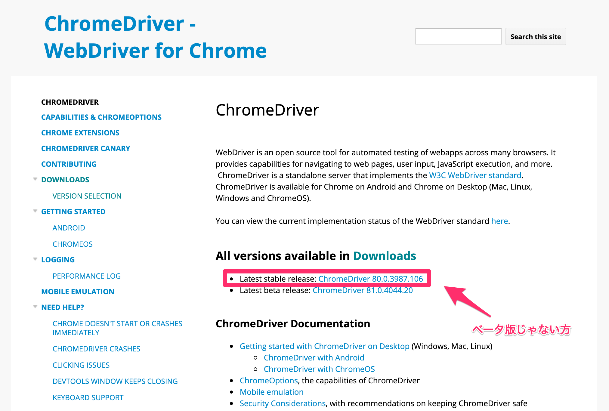
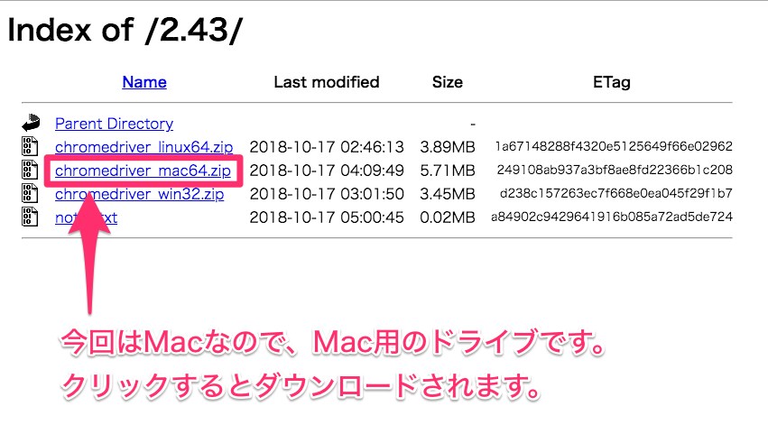

# Automatically-TOT
touch on time での打刻忘れませんか？自動的に打刻してもらいましょう！え？W

## デモ


## 環境構築

shell は Unix で書いてますので windows の場合は変更して解釈してください。

- 1. python(Anaconda)


    [anaconda 公式](https://www.anaconda.com/products/individual#Downloads)で自分の OS を選択してインストール

    - ターミナルで `(base)` <- が書かれてあることの確認
    ```shell
    python version
    ``` 
    - で 3.x.x のバージョンであることの確認

    依存モジュールのインストール
    ```shell
    pip install -r requirements.txt
    ```


- 2. Chrome driver のダウンロード


    [ダウンロードサイト](https://sites.google.com/a/chromium.org/chromedriver/home)で以下を選ぶ
    

    さらに、自分の OS のものを選ぶ
    

    このレポジトリの `driver/chromedriver` に配置する

- 3. 設定ファイルを作成


    `config.yaml` に touch on time のログインするユーザーの ID と PASSWORD を記載。

    このレポジトリのパスを取得する
    ```shell
    pwd ・・・・①
    ``` 
    この結果①を使い、`config.yaml` の `chromedriver` : {①}/driver/chromedriver を記載。

- 4. crontab の登録


    python のパスを取得する
    ```shell
    which python3 ・・・②
    ```
    ここで `fogefoge/anaconda3/bin/python3` ってなっていれば OK
    なっていなければ、anaconda がうまくいってない

    ```sell
    crontab -e
    ```
    で vim か nano 方式で以下を記載。

    ```
    ZONE="Asia/Tokyo"
    0 9 * * 1-5 {①} {②}/main.py -p {②}/config.yaml -i >> {②}/tot.log 2>&1
    0 19 * * 1-5 {①} {②}/main.py -p {②}/config.yaml -o >> {②}/tot.log 2>&1
    ```
    この例では平日(休日考慮してません)の 9時出社、19時退社になります。

## 実行

実行結果のログは `tot.log` に出力されます。
```
===> done <===
```
が書いてあれば正常動作しました。

cron で実行前に確認したい方は
```shell
python3 main.py -h
```
これでオプションが確認できます。

p.s. `-w` で実際に操作している画面を確認することも可能です。

    
    


